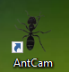
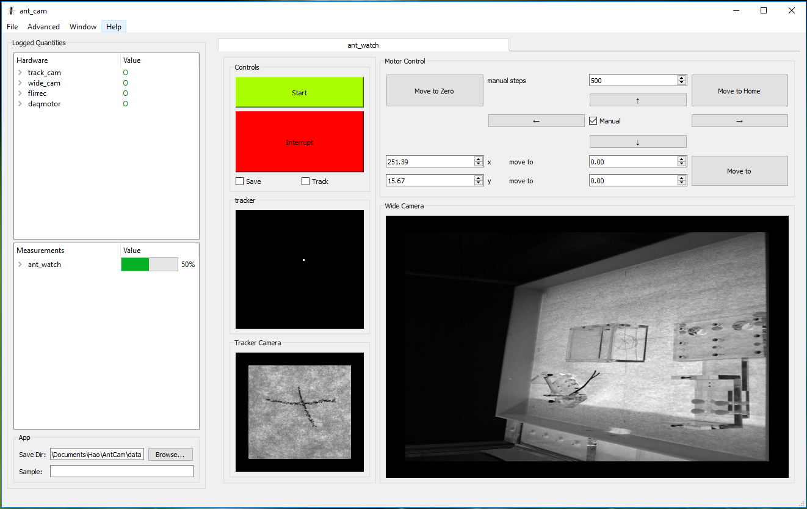

# AntCam

This is the software for controlling the ant tracking setup, the work was done at the [Murthy Lab](https://vnmurthylab.org/) at Harvard University.

## Getting Started

### Prerequisites

The package is written with [Anaconda Python 3.6 distribution](https://www.anaconda.com/download/), [ScopeFoundry](http://www.scopefoundry.org/) is used as the framework for user interface. After the installation of Anaconda 3, get the following packages: 

```
conda install numpy pyqt qtpy h5py pyqtgraph
pip install ScopeFoundry
```

PyDAQmx is used for controlling the National Instrument DAQ (which in turn controls the motors):

```
pip install PyDAQmx
``` 

OpenCV is used for loading avi video:

```
pip install opencv-python
```

You also need to install the driver and SDK, and Python binding PySpin for FLIR Point Grey cameras. They drivers, SDK and PySpin can be downloaded from the [FLIR Spinnaker website](https://www.ptgrey.com/spinnaker-sdk)

### Installing

Clone this repository to your computer, modify the RunAntCam.bat file to

```
YOUR_ANACONDA_PATH\python main_interface.py
```

After you've modified the RunAntCam.bat, you can execute RunAntCam.bat to run the AntCam software with a command window, or execute RunAntCamQuiet.bat to run the software without a command window. You could create shortcut to these two files. The icon for AntCam is ant_icon.ico

## Using AntCam

To start AntCam, either start anaconda prompt, go to the directory of ant cam and type in

```
python main_interface.py
```

or use the shortcut from the desktop:


The GUI should start as follow:


If you have more questions, please ask Hao Wu [fullerene12](https://github.com/fullrene12) to get a tutorial of the software.

## Analysis Code

The analysis code was written in Jupyter Notebook. In Anaconda Prompt, type in:

```
jupyter notebook
```

To get the Jupyter Notebook server to start up.

In the base directory, use the notebook server to open video_analysis.ipynb, run the first cell, and set up the parameters in the second cell (e.g. file names and starting frame for data processing.). Output video will be saved at the same folder as the input data, in TIFF stacks.

There will be two output videos. zoomed_view.tif is the stablized closeup video of the moving ant. wide_view.tif is the video of the entire arena while tracking. The two video are synchronized.

## Contributors

* **Hao Wu** - *Software Development* - [fullerene12](https://github.com/fullrene12) 
* **Ryan Draft** - *hardware design and building, protocol design and testing*
* **Souvik Mandal** - *protocol design, testing and artwork*
* **Vikrant Kapoor** - *hardware design and building*

## License

This project is licensed under the MIT License - see the [LICENSE.md](LICENSE.md) file for details

## Acknowledgments

* Edward Barnard for the ScopeFoundry framework [edbarnard](https://github.com/edbarnard)
* Daniel Dietz for uc480 code [ddietz](http://ddietze.github.io/Py-Hardware-Support/index.html)
* Frank Ogletree for getting me started using python for hardware control